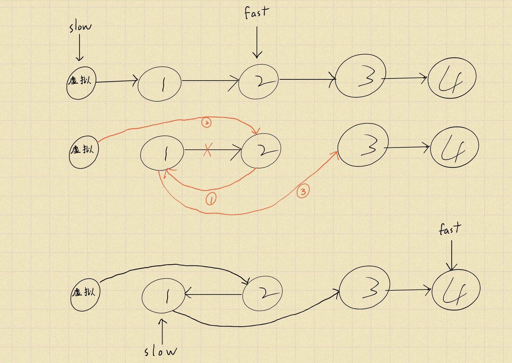

# 24.两两交换链表中的节点

[LeetCode链接](https://leetcode-cn.com/problems/swap-nodes-in-pairs/)

使用双指针法，画一张图，清晰明了：


代码如下：

```c++
class Solution {
public:
    ListNode* swapPairs(ListNode* head) {
        struct ListNode *dummyHead = new ListNode(0,head);    //创建虚拟头结点
        struct ListNode *fastPointer;    //创建快指针
        struct ListNode *slowPointer;    //创建慢指针
        if (dummyHead->next != NULL) {
            fastPointer = dummyHead->next;    //快指针指向头结点（交换区间前一结点）
            slowPointer = dummyHead;    //慢指针指向虚拟头结点
            while (fastPointer != NULL && fastPointer->next != NULL) {    
                //无第一个判定条件会导致runtime error: member access within null pointer of type 'struct ListNode'
                //错误原因：试图使用空指针
                //解决方法：增加判断条件，并且判断的顺序不能改变。排除对空指针的引用。
                fastPointer = fastPointer->next;    //快指针指向交换区间后一结点
                struct ListNode *temp = fastPointer->next;    //暂存下一区间结点地址
                fastPointer->next = slowPointer->next;    //交换区间后一结点next指向当前区间前一结点
                slowPointer->next = fastPointer;    //上一区间后一结点next指向当前区间前一结点
                fastPointer->next->next = temp;    //当前区间前一结点next指向下一区间前一结点地址（或NULL）
                fastPointer = temp;    //快指针指向下一区间前一结点（获置NULL）
                slowPointer = slowPointer->next->next;    //慢指针指向当前区间后一结点
                
            }
        }
    return dummyHead->next;    //即返回head
    }
};
```
