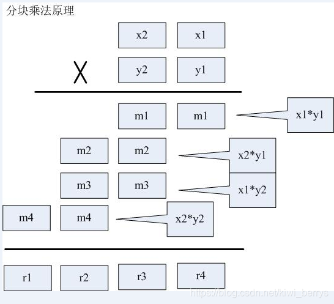

对于32位字长的机器，大约超过20亿，用int类型就无法表示了，
我们可以选择_int64类型，但无论怎样扩展，固定的整数类型总是有表达的极限！
如果对超级大整数进行精确运算呢?
一个简单的办法是：仅仅使用现有类型，但是把大整数的运算化解为若干小整数的运算，即所谓“分块法”。
下图表示了分块乘法的原理。



可以把大数分成多段（此处为2段）小数，然后用小数的多次运算组合表示一个大数。
可以根据int的承载能力规定小块的大小，比如要把int分成2段，则小块可取10000为上限值。
注意，小块在进行纵向累加后，需要进行进位校正。
以下代码示意了分块乘法的原理（乘数、被乘数都分为2段），请分析代码逻辑，并推测划线处的代码。

```c++
void bigmul(int x,int y,int r[])
{ 
	int base=10000;
	int x2=x/base;
	int x1=x%base;
	int y2=y/base;
	int y1=y%base;
	int n1=x1*y1;
	int n2=x1*y2;
	int n3=x2*y1;
	int n4=x2*y2;
	r[3]=n1%base;
	r[2]=n1/base+n2%base+n3%base;
	r[1]=____________________ n2/base+n3/base+n4%base;  //填空
	r[0]=n4/base;
	r[1]+=____________________;  //填空
	r[2]=r[2]%base;
	r[0]+=r[1]/base;
	r[1]=r[1]%base;
}

int main(int argc,char *argv[])
{ 
	int x[]={0,0,0,0};
	bigmul(87654321,12345678,x);
	printf("%d%d%d%d\n",x[0],x[1],x[2],x[3]);
	return 0;
}
```